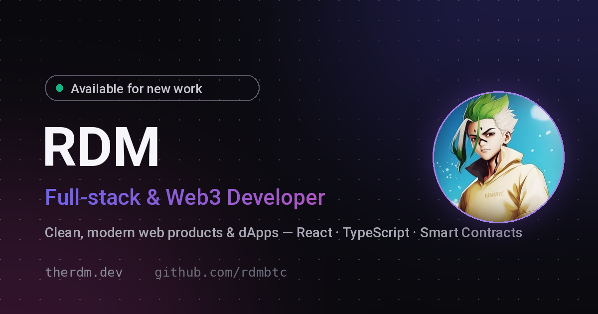

# therdm.dev — Portfolio

Personal portfolio of **RDM** — full-stack & Web3 developer. Live at **[therdm.dev](https://therdm.dev)**.



## Highlights

- 🎬 **Scroll-scrubbed hero** — 240-frame canvas sequence driven by GSAP ScrollTrigger + Lenis smooth scroll
- 📖 **Per-project stories** — pinned horizontal scroll sections for featured builds
- ⌨️ **Command menu** — `⌘K` navigation, copy-to-clipboard socials, theme & perf-HUD toggles
- 🔍 **Live GitHub data** — stars/language/description merged from the GitHub API, cached in localStorage (6h TTL)
- 🌓 **Dark/light theme** — system-aware, no flash-of-wrong-theme on load
- 📊 **Adaptive performance** — FPS monitor auto-throttles the frame sequence under jank

## Stack

| | |
|---|---|
| Framework | React 19 + [TanStack Start](https://tanstack.com/start) (SSR) |
| Styling | Tailwind CSS v4 + shadcn/ui (Radix) |
| Animation | GSAP ScrollTrigger, Lenis |
| Build | Vite 7 + Nitro (Vercel preset), Bun |

## Development

```bash
bun install
bun run dev      # dev server
bun run build    # production build (.vercel/output)
bun run lint     # eslint
```

## Structure

```
src/
├── routes/          # TanStack Router file routes (index.tsx = the whole page)
├── components/      # ScrollSequence, ProjectStory, ProjectModal, ui/ (shadcn)
├── data/projects.ts # Curated repo list (descriptions, tags, screenshots)
├── hooks/           # useRepoMeta (live GitHub metadata)
└── lib/             # repoCache, perf monitor, utils
public/
├── frames/          # Hero scroll sequence (240 frames)
└── shots/           # Project screenshots (WebP)
```

## Deployment

Deployed on Vercel — `vercel.json` runs `bun run build`, Nitro outputs to `.vercel/output`.
